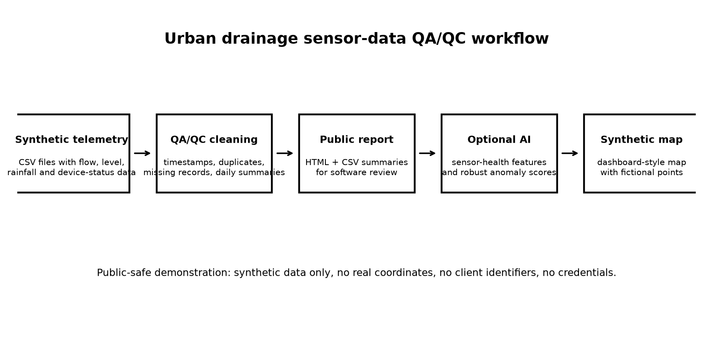
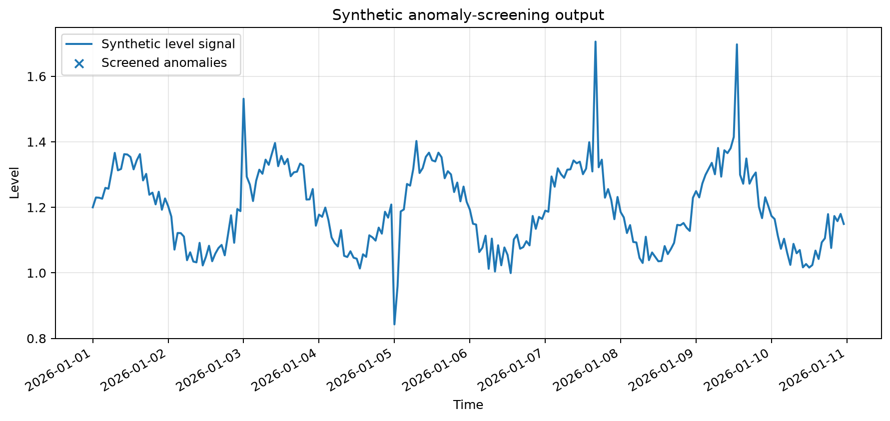
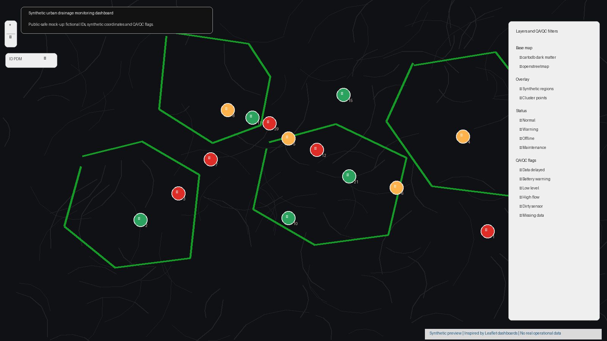

# Urban Drainage Sensor Data Toolkit


Public-safe Python toolkit for **urban drainage and water-network telemetry QA/QC**, automated reporting, synthetic monitoring examples, and optional applied-AI anomaly screening.

The project demonstrates how private operational monitoring workflows can be converted into a clean research-software package using synthetic examples, tests, documentation, and strict publication boundaries.

For a short explanation of the private-to-public conversion strategy and engineering workflow, see [docs/case_study.md](docs/case_study.md).

> **Status:** prototype / repository conversion.  
> The package is suitable for public demonstration and software review. It is not a drop-in replacement for the original operational system.

---

## Why this repository matters

Urban drainage monitoring systems often combine telemetry from remote devices, FTP folders, SCADA-style exports, rainfall gauges, configuration tables, and field metadata. Before those data can support reporting, decision-making, or machine learning, they need reliable QA/QC.

This repository provides a public-safe version of that workflow. It focuses on:

- timestamp parsing and cleaning
- duplicate record detection
- missing-data and last-contact checks
- daily summaries and static HTML/CSV reports
- private-folder auditing without publishing row values
- synthetic monitoring data for public demonstrations
- optional sensor-health anomaly screening
- synthetic monitoring-point map / synthetic network demo generation

This project complements my wider portfolio on engineering monitoring systems, sensor-data QA/QC, anomaly detection, and public-safe research software.

---

## Visual overview



The public workflow starts from synthetic telemetry, applies QA/QC checks, writes static reports, and optionally produces anomaly-screening and map outputs.

---

## What this repository demonstrates

| Area | What is demonstrated |
|---|---|
| Engineering data QA/QC | Timestamp parsing, duplicate handling, missing-row estimates, digital-event forward filling, mixed-folder audits |
| Urban hydrology monitoring | Flow, level, velocity, rainfall, battery, last-contact checks, event detection, and response summaries |
| Automated reporting | Static HTML, CSV summaries, report-summary plots, and synthetic network reports |
| Public-safe release | Synthetic data and private-data guidance instead of real operational records |
| Optional applied AI | Explainable sensor-health features and robust anomaly scoring on synthetic telemetry |
| Synthetic map output | Dashboard-style monitoring map with fictional points and synthetic coordinates only |
| Research software | `src/` package structure, CLI, tests, CI, docs, examples, and limitations |

---

## Example visual outputs

### Applied-AI anomaly screening



The anomaly-screening example uses synthetic telemetry and an explainable robust baseline. It is included as a transparent demonstration, not as a validated production ML model.

### Synthetic monitoring dashboard map



The dashboard-style map preview reflects the original private monitoring workflow more closely while remaining public-safe. It includes a dark map-style background, synthetic clustered points, fictional region boundaries, a search box, layer controls, and QA/QC filters. All points, coordinates, IDs, filters, and labels are synthetic.

---

## Workflow overview

```text
Private telemetry structure
        │
        ├── local private audit, never committed
        ├── schema and data-quality checks
        └── reusable public-safe utilities
                ↓
Synthetic telemetry CSVs
        ↓
cleaning / QA/QC
        ↓
daily summaries + static HTML/CSV report
        ↓
optional sensor-health features + anomaly scores
        ↓
synthetic monitoring-point map / synthetic network demo
```

---

## Example outputs

The repository uses synthetic data only. The examples are designed to show the workflow without exposing real sites, coordinates, client names, or operational identifiers.

### 1. QA/QC report

Run:

```bash
urban-drainage-qaqc demo
```

Expected output:

```text
examples/outputs/demo/report/
├── report.html
├── report_summary.png
├── summary.csv
└── file_inventory.csv
```

The report summarises synthetic telemetry files, cleaned records, duplicate timestamps, missing-row estimates, time coverage, and daily QA/QC summaries.

### 2. Applied-AI anomaly-screening demo

Run:

```bash
python examples/ml/run_anomaly_demo.py
```

Expected output:

```text
examples/outputs/ml_anomaly_demo/
├── anomaly_plot.png
├── anomaly_scores.csv
├── anomaly_summary.csv
└── sensor_health_features.csv
```

### 3. Synthetic monitoring dashboard map

Run:

```bash
urban-drainage-qaqc map-demo
```

Expected output:

```text
examples/outputs/synthetic_map/
├── synthetic_monitoring_points.csv
└── synthetic_monitoring_points.html
```

Open the HTML file locally in a browser to view the public-safe Leaflet map. The map uses fictional point IDs and synthetic coordinates only.

### 4. Synthetic multi-sensor network demo

Run:

```bash
urban-drainage-qaqc network-demo
```

Expected output:

```text
examples/outputs/network_demo/
├── report.html
├── network_summary.csv
├── event_summary.csv
├── sensor_response_summary.csv
├── status_summary.csv
├── rainfall_level_flow.png
├── synthetic_monitoring_points.html
└── data/
    ├── rain_gauge_001.csv
    ├── level_sensor_001.csv
    ├── level_sensor_002.csv
    ├── flow_sensor_001.csv
    ├── battery_status.csv
    └── monitoring_points.csv
```

The network demo shows the end-to-end public workflow: synthetic rainfall and sensor telemetry, event detection, hydraulic response summaries, status-rule checks, report generation, and a dashboard-style map.

---

## Quick start with Anaconda

```powershell
conda create -n urban-drainage-qaqc python=3.11 -y
conda activate urban-drainage-qaqc

python -m pip install --upgrade pip
python -m pip install -e ".[dev]"
python -m pytest -q
```

Run the public QA/QC demo:

```powershell
urban-drainage-qaqc demo
```

Run the optional applied-AI demo:

```powershell
python examples\ml\run_anomaly_demo.py
```

Run the synthetic map demo:

```powershell
urban-drainage-qaqc map-demo
```

Run the synthetic network demo:

```powershell
urban-drainage-qaqc network-demo
```

Run code quality checks:

```powershell
ruff check .
```

---

## Command-line usage

Create synthetic telemetry:

```bash
urban-drainage-qaqc create-synthetic --output examples/data/synthetic_monitoring_point.csv
```

Run QA/QC over the synthetic example folder:

```bash
urban-drainage-qaqc run --input examples/data --output examples/outputs/synthetic_report
```

Audit a private local folder without publishing row values:

```bash
urban-drainage-qaqc audit --input "path/to/private/folder" --output "private_audit"
```

Run the synthetic network demo:

```bash
urban-drainage-qaqc network-demo
```

Keep private audit outputs outside Git or in ignored folders.

---

## Optional applied-AI extension

The applied-AI component is intentionally lightweight and transparent. It is included to show how cleaned telemetry can be converted into basic sensor-health features and screened for anomalous behaviour.

It demonstrates:

- missing-data indicators
- rolling mean and rolling standard deviation
- rate-of-change features
- spike screening
- flat-line detection
- robust anomaly scoring
- compact sensor-health summaries

The default method is an explainable robust baseline, not a validated production ML model. It uses synthetic telemetry only.

Run:

```bash
python examples/ml/run_anomaly_demo.py
```

---

## Synthetic dashboard map example

The original private workflow produced map-style outputs for monitoring points. The public repository does **not** include real point maps because those can expose coordinates, client names, project identifiers, and asset IDs.

The synthetic map example demonstrates the same output family safely:

```bash
urban-drainage-qaqc map-demo
```

Outputs:

```text
examples/outputs/synthetic_map/
├── synthetic_monitoring_points.csv
└── synthetic_monitoring_points.html
```

Public-safety rule: only synthetic or anonymised points should be used in public examples.

---

## What is included

```text
src/urban_drainage_sensor_toolkit/
├── audit.py          # private-folder audit helpers
├── cli.py            # command-line interface
├── core.py           # core cleaning and QA/QC functions
├── io_utils.py       # input/output helpers
├── events.py         # rainfall-event detection and response joins
├── hydrology.py      # simple hydraulic-response metrics
├── maps.py           # public-safe synthetic map generation
├── network_report.py # synthetic network report generation
├── reporting.py      # HTML/CSV report and plot generation
├── status_rules.py   # stale-data, battery, flatline, level and flow checks
├── synthetic.py      # synthetic telemetry generation
├── synthetic_network.py # synthetic multi-sensor network generation
└── ml/               # optional applied-AI anomaly screening
```

Other important folders:

```text
.github/workflows/    # CI checks
docs/                 # public documentation
examples/             # synthetic data and demos
scripts/              # helper scripts
tests/                # automated tests
tools/                # private sampling helpers
```

---

## What is not included

This public repository intentionally excludes:

- original operational telemetry
- real `INPUT/`, `DATA/`, `REPORT/`, or `OUTPUT/` folders
- private samples
- credentials, tokens, pickles, and local configuration files
- real maps, coordinates, client names, project names, or asset identifiers
- generated private reports

The `.gitignore` is intentionally strict and excludes common private/local artefacts:

```text
INPUT/
DATA/
REPORT/
OUTPUT/
PRIVATE_SAMPLE*/
private_audit*/
private_report*/
credentials.json
*token*
*.pickle
*.pkl
TOPO/
TEMP/
```

---

## Validation

Local validation used during the public-clean release:

```bash
python -m pytest -q
urban-drainage-qaqc demo
python examples/ml/run_anomaly_demo.py
urban-drainage-qaqc map-demo
urban-drainage-qaqc network-demo
ruff check .
```

Expected result:

```text
tests pass
demo report generated
anomaly-screening outputs generated
synthetic map generated
synthetic network demo generated
ruff passes
```

---

## Limitations

- The public examples are synthetic.
- The applied-AI demo is an explainable baseline, not a validated production model.
- The map example uses fictional coordinates only.
- Private operational data should remain outside Git.
- Local private audit results should be reviewed before sharing.
- This repository demonstrates a public-safe workflow conversion, not a full operational replacement.

---

## Suggested citation / attribution

If you use this repository as a reference for public-safe engineering telemetry workflows, please cite the repository URL:

```text
Sergio Lopez Dubon, Urban Drainage Sensor Data Toolkit, GitHub repository.
https://github.com/sergioald/urban-drainage-sensor-data-toolkit
```

---

## License

MIT License.
